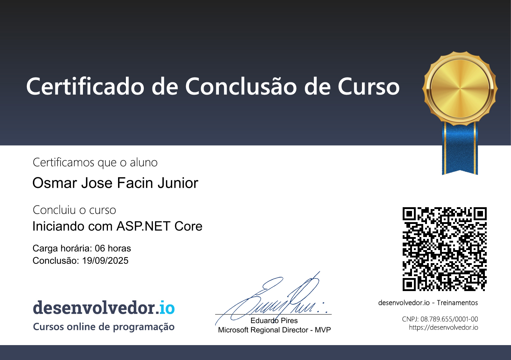

# Iniciando com ASP.NET Core

Repositório com os códigos e exemplos do curso **“Iniciando com ASP.NET Core”** da plataforma [desenvolvedor.io](https://desenvolvedor.io/).

> Este repositório tem finalidade **exclusivamente didática**.

## Tecnologias

- ASP.NET Core MVC
- Razor Pages
- Blazor Server
- Blazor WebAssembly (WASM)
- ASP.NET Core Web API

## Certificado

## Como executar

Cada projeto pode ser executado individualmente com:
`dotnet run` na pasta do projeto desejado:

> AspNetBeginner.Mvc
> AspNetBeginner.RazorPages
> AspNetBeginner.Blazor 
> AspNetBeginner.BlazorWasm
> AspNetBeginner.WebApi